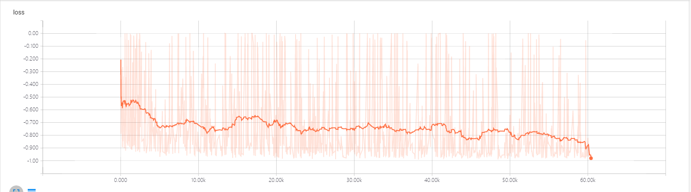
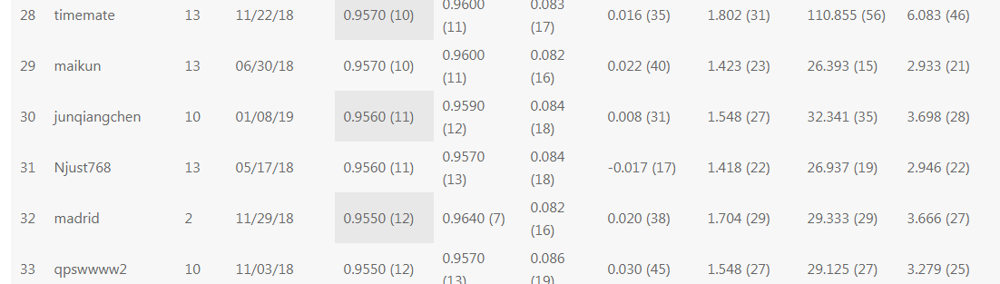
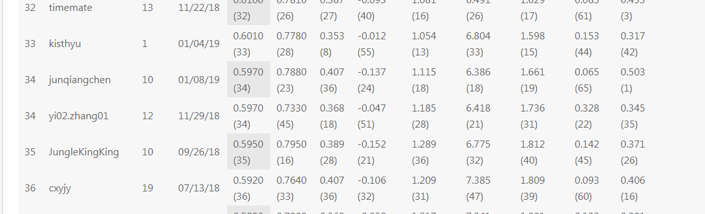

# ImageSegmentation With Vnet3D
> This is an example of the CT images Segment from LiTS---Liver-Tumor-Segmentation-Challenge

## How to Use
(re)implemented the model with tensorflow in the paper of "Milletari, F., Navab, N., & Ahmadi, S. A. (2016) V-net: Fully convolutional neural networks for volumetric medical image segmentation.3DV 2016"

**1、get the patch srcimages and maskimages in the script of getPatchImageAndMask.py**

**2、VNet implementation in the model of Vnet**

**3、train and predict in the script of vnet3d_train.py and vnet3d_predict.py**

**4、liver segmentation trained model,log,test data can download on here:https://pan.baidu.com/s/1ijK6BG3vZM4nHwZ6S2yFiw, password：74j5**

**5、LiTS data have 130 cases,using 0-110 cases trainging,and other is testing.testing result can download on here:https://pan.baidu.com/s/1A_-u7tJcn7rIqnrLaSqi4A password：22es** 

## Result
Trained Loss

Liver Segment Result

Liver leaderboard

test case segmentation result can see in the file of 35.mp4,38.mp4 and 51.mp4

first col is srcimage,second col is GroundTruth Mask image,third col is VNet segmentation image

Lesion leaderboard

## Contact
* https://github.com/junqiangchen
* email: 1207173174@qq.com,ydx0902@gmail.com,188123134@qq.com
* Contact:junqiangChen,dexianYe,xingTao
* WeChat Public number: 最新医学影像技术
